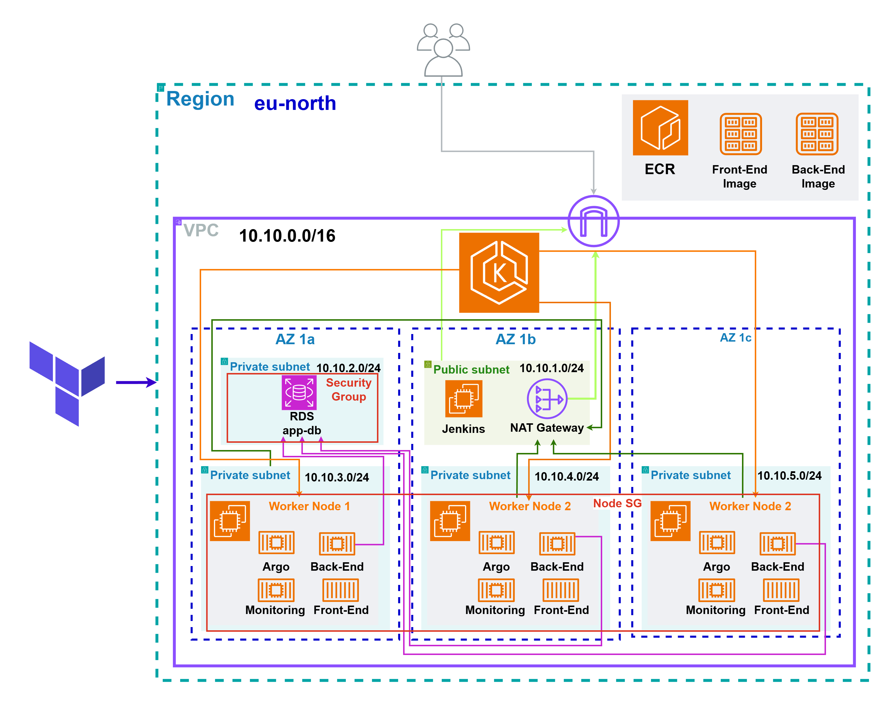
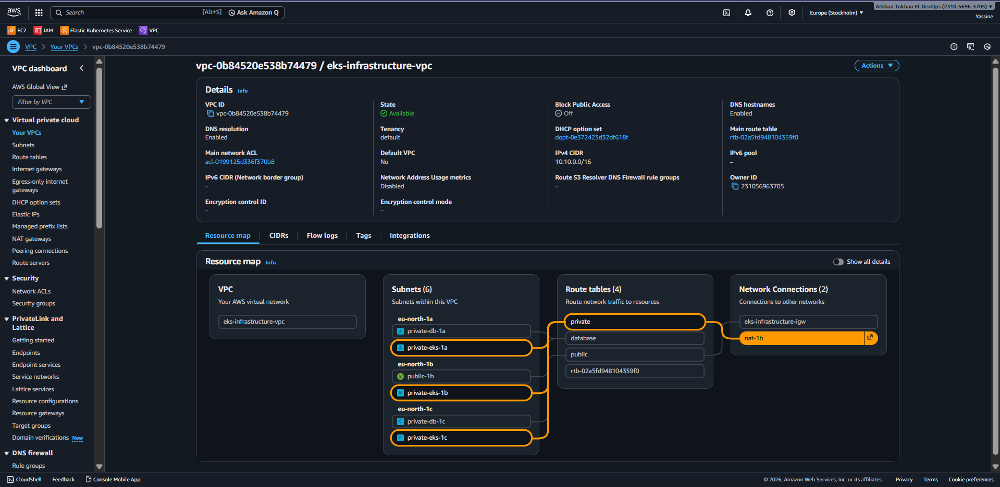
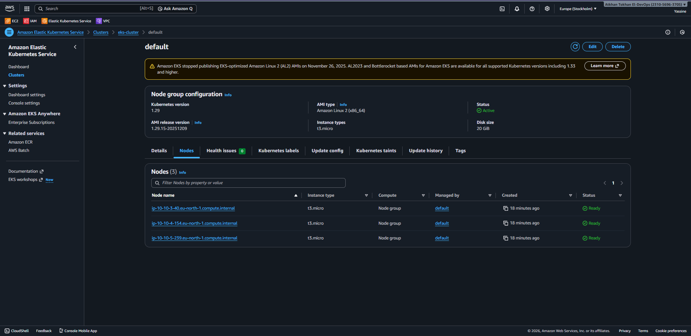
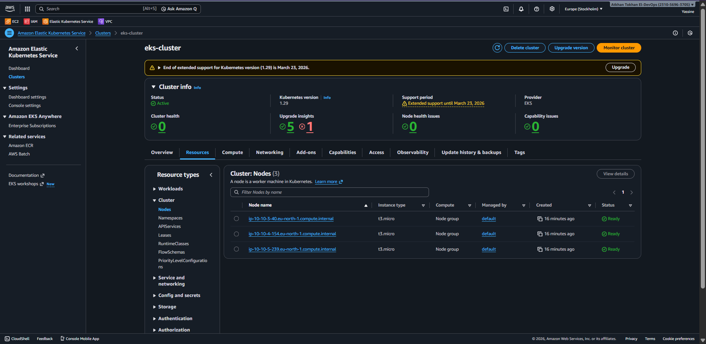
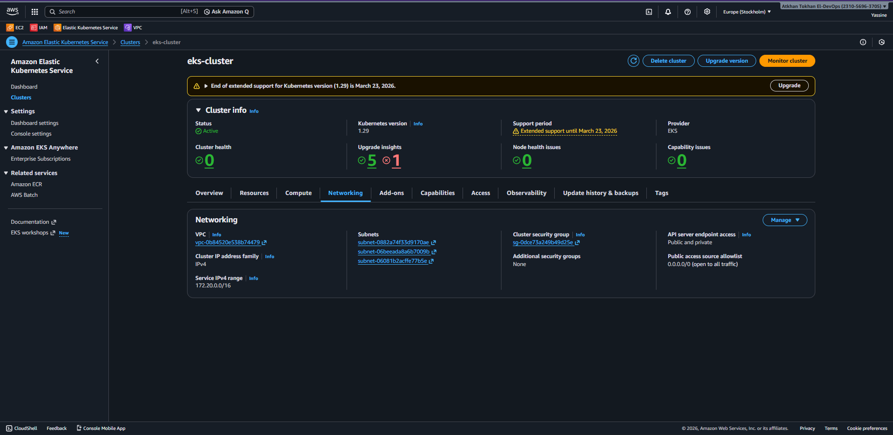
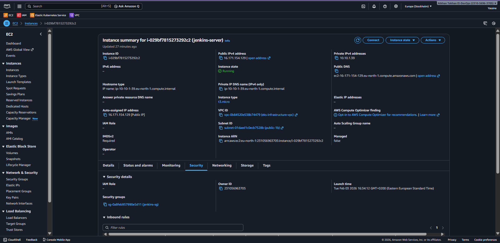
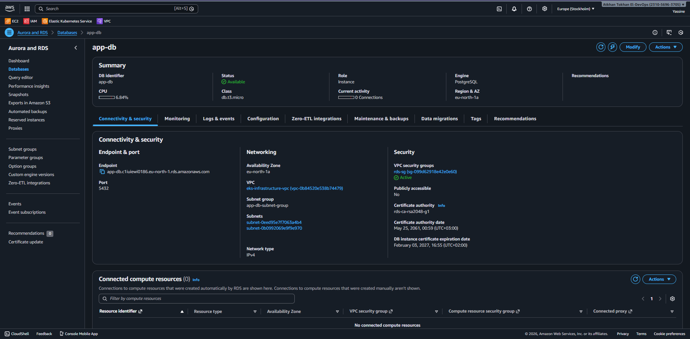
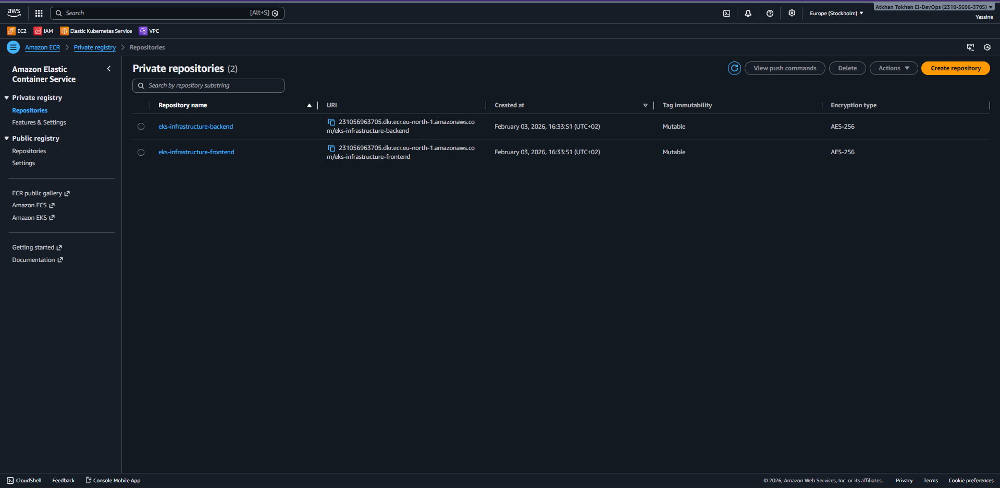
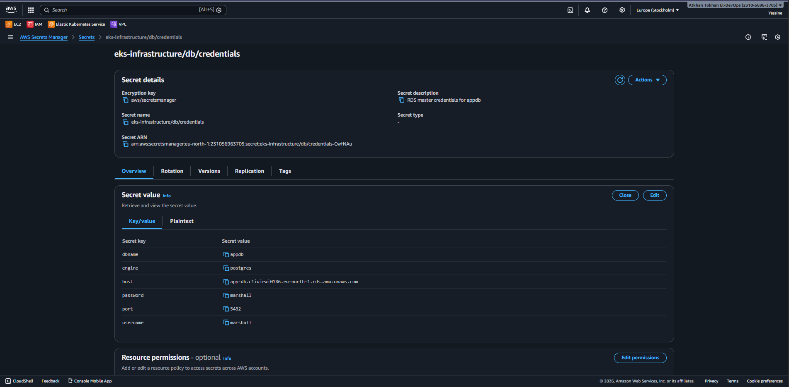
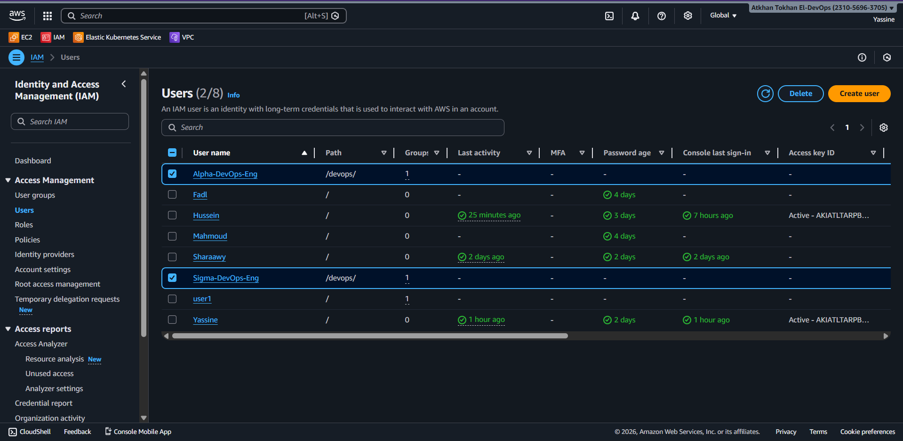

# AWS EKS Infrastructure with Terraform

## Overview

This repository provisions a production-grade AWS infrastructure using Terraform, centered around Amazon EKS with supporting services for CI/CD, networking, security, and persistence.

The design follows a modular, explicit, and reviewable approach:

- Each AWS service is encapsulated in its own Terraform module
- IAM responsibilities are clearly separated
- Networking is deterministic and AZ-aware
- Secrets are handled via AWS Secrets Manager
- No implicit AWS defaults are relied upon

**This setup is intended for:**
- Learning real-world AWS + Terraform patterns
- Team collaboration and review
- Extension into a full CI/CD + GitOps workflow (ArgoCD planned)

---

## High-Level Architecture

- **Region:** `eu-north-1`
- **Availability Zones:** `eu-north-1a`, `eu-north-1b`, `eu-north-1c`

### Core Components

- VPC with public and private subnets
- Internet Gateway + NAT Gateway
- Amazon EKS (private worker nodes)
- EC2 Jenkins server (public subnet)
- Amazon RDS (PostgreSQL) in private subnets
- Amazon ECR repositories (frontend / backend)
- AWS Secrets Manager
- IAM users, groups, and policies

> 📸 *Screenshot placeholder: Overall VPC / architecture diagram*

---

## Network Topology

### VPC

- **CIDR:** `10.10.0.0/16`
- DNS support and hostnames enabled

### Subnet Layout

| AZ | Subnet | CIDR | Type | Purpose |
|----|--------|------|------|---------|
| 1a | private-db-1a | 10.10.2.0/24 | Private | RDS primary |
| 1a | private-eks-1a | 10.10.3.0/24 | Private | EKS nodes |
| 1b | public-1b | 10.10.1.0/24 | Public | Jenkins |
| 1b | private-eks-1b | 10.10.4.0/24 | Private | EKS nodes |
| 1c | private-db-1c | 10.10.6.0/24 | Private | RDS subnet group |
| 1c | private-eks-1c | 10.10.5.0/24 | Private | EKS nodes |

### Routing

- **Public subnets** → Internet Gateway
- **Private subnets** → NAT Gateway
- **Database subnets** → Isolated (no outbound route)

---




## Amazon EKS

### Cluster

- Kubernetes version configurable via variables
- Control plane managed by AWS
- Cluster IAM role explicitly defined and attached

### Node Groups

**Managed Node Group:**
- Private subnets only
- Instance type configurable
- Fixed desired/min/max size (predictable cost)
- IAM node role explicitly injected

> 📸 *Screenshot placeholder: EKS cluster overview*  
> 📸 *Screenshot placeholder: Node group status (ACTIVE)*





### Design Notes

- No AMI is hardcoded — EKS selects the correct optimized image
- Node access is restricted via security groups
- Designed to integrate with ArgoCD later

---

## Jenkins (CI)

**EC2 instance in public subnet:**
- Amazon Linux–based AMI
- Docker installed
- Jenkins installed and enabled at boot
- Accessible on port 8080

### Security

- SSH (22) open for management
- Jenkins UI (8080) open
- Outbound traffic unrestricted

> 📸 *Screenshot placeholder: EC2 instance details*  

---

## Amazon RDS (PostgreSQL)

**Configuration:**
- **Engine:** PostgreSQL 14
- Single-AZ (cost-aware)
- Subnet group spans 2 AZs (AWS requirement)
- Storage encrypted
- Backups disabled (intentional for non-prod)
  


### Security

- No public access
- Ingress allowed only from EKS node security group

> 📸 *Screenshot placeholder: RDS instance details*

---

## Amazon ECR

**Two repositories:**
- `<project>-frontend`
- `<project>-backend`

### Features

- Image scanning on push
- Mutable tags
- Force delete enabled (non-prod convenience)

> 📸 *Screenshot placeholder: ECR repositories list*

---

## Secrets Management

Secrets are stored in **AWS Secrets Manager**, not in Terraform state outputs.

**Example:**
- Database credentials
- Connection metadata (host, port, engine)

**This enables:**
- Safe injection into Kubernetes later
- Zero plaintext secrets in code

> 📸 *Screenshot placeholder: Secrets Manager secret details*

---

## IAM Structure

### Groups

- **DevOps-Engineers**
  - Attached to a custom AdminAccess policy

### Users

- `Alpha-DevOps-Eng`
- `Sigma-DevOps-Eng`

Users are explicitly added to the group via memberships.

> 📸 *Screenshot placeholder: IAM groups*  
> 📸 *Screenshot placeholder: IAM users*


---

## Terraform Structure

```
.
├── main.tf
├── variables.tf
├── outputs.tf
├── modules/
│   ├── vpc/
│   ├── subnet/
│   ├── internet-gateway/
│   ├── nat-gateway/
│   ├── route-table/
│   ├── route-table-association/
│   ├── security-group/
│   ├── security-group-rule/
│   ├── eks/
│   ├── rds/
│   ├── ec2/
│   ├── ecr/
│   ├── secret-manager/
│   ├── iam-role/
│   ├── iam-role-policy-attachment/
│   ├── iam-policy/
│   ├── iam-group/
│   ├── iam-user/
│   └── iam-user-group-membership/
```

**Each module:**
- Manages a single AWS responsibility
- Exposes explicit outputs
- Avoids hidden dependencies

---

## How to Deploy

### Initialize Terraform
```bash
terraform init
```

### Validate Configuration
```bash
terraform validate
```

### Plan Infrastructure Changes
```bash
terraform plan
```

### Apply Changes
```bash
terraform apply
```

### Save and Apply Plan
```bash
terraform plan -out=tfplan
terraform apply tfplan
```

---

## Cost & Scope Notes

- Designed to stay as close to free-tier as possible
- NAT Gateway and EKS control plane incur unavoidable costs
- No autoscaling surprises
- No managed add-ons enabled implicitly

---

## License

This project is provided as-is for educational and development purposes.

---
